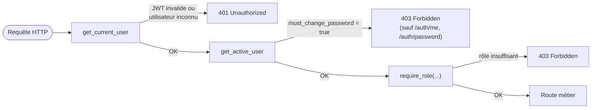
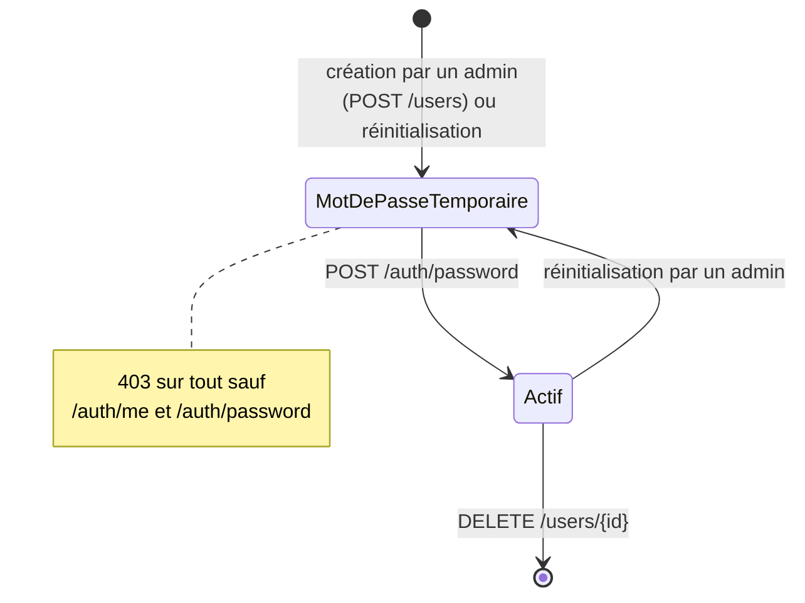

# API — Backend

# `api/` — API REST

FastAPI + SQLAlchemy + PostgreSQL. Sert le front et expose, sous `/api/v1`, l'authentification, la gestion des comptes, les alertes, les sites et leurs mesures.

Documentation interactive générée automatiquement : **http://localhost:8000/docs**.

## Structure

```
api/
├── main.py          Application FastAPI : CORS, montage des routers, /health
├── config.py        Configuration (pydantic-settings), lue depuis le .env racine
├── database.py      Engine SQLAlchemy, SessionLocal, dépendance get_db
├── models.py        Modèles ORM (miroir du schéma infra/postgres/init/)
├── schemas.py       Schémas Pydantic d'entrée/sortie
├── auth.py          Hachage bcrypt, JWT, dépendances d'autorisation
├── create_admin.py  Script d'amorçage du premier compte admin
├── routers/         Un module par domaine (auth, users, alerts, sites, sensors)
└── tests/           pytest, SQLite en mémoire — aucune dépendance externe
```

## Endpoints

Tout est préfixé par `/api/v1`, sauf `/health`.

| Méthode | Route | Accès | Description |
|---------|-------|-------|-------------|
| `GET`   | `/health` | public | Sonde de vivacité (utilisée par le HEALTHCHECK Docker) |
| `POST`  | `/auth/login` | public | Formulaire OAuth2 (`username` = email) → JWT |
| `GET`   | `/auth/me` | connecté | Profil : rôle, `must_change_password` |
| `POST`  | `/auth/password` | connecté | Changement de son propre mot de passe |
| `GET`   | `/alerts` | actif | Alertes remontées par `etl-alerts` |
| `GET`   | `/sites` | actif | Liste des sites |
| `GET`   | `/sites/{id}/measurements` | actif | Mesures silver du site |
| `GET`   | `/sites/{id}/daily-summary` | actif | Agrégat gold journalier |
| `GET`   | `/sites/{id}/current` | actif | Relevé instantané — **relais direct** de l'API Mock IoT, sans stockage |
| `GET`   | `/sites/{id}/predictions` | actif | Prévisions horaires produites par `ml-predict` |
| `GET`   | `/sensors/failing` | actif | Capteurs en panne, par site (relais de l'API Mock IoT) |
| `GET`   | `/users` | **admin** | Liste des comptes |
| `POST`  | `/users` | **admin** | Création d'un compte (mot de passe temporaire) |
| `PATCH` | `/users/{id}` | **admin** | Changement de rôle |
| `POST`  | `/users/{id}/password` | **admin** | Réinitialisation du mot de passe |
| `DELETE` | `/users/{id}` | **admin** | Suppression |

## Authentification et autorisation

Trois dépendances, en escalier — chacune s'appuie sur la précédente ([`auth.py`](auth.py)) :

| Dépendance | Garantit |
|------------|----------|
| `get_current_user` | JWT valide, utilisateur existant en base |
| `get_active_user` | \+ mot de passe **à jour** (sinon `403`) |
| `require_role(...)` | \+ rôle parmi ceux listés (sinon `403`) |

Le rôle (`viewer` < `operator` < `admin`) est encodé dans le JWT **et** revérifié en base à chaque requête : révoquer un compte prend effet immédiatement, sans attendre l'expiration du token.

`get_current_user` n'est utilisé **que** par `/auth/me` et `/auth/password` : ce sont les seules routes accessibles à un compte encore sur son mot de passe temporaire. Partout ailleurs la garde est portée par l'API, pas seulement par la redirection du front.

### Cycle de vie d'un compte


1. Un admin crée le compte via `POST /users` en fixant un mot de passe temporaire.
2. Le compte a `must_change_password = true` : `403` sur tout sauf `/auth/me` et `/auth/password`.
3. `POST /auth/password` bascule le drapeau à `false` et débloque l'application.

Même mécanisme après une réinitialisation par un admin.

### Premier compte admin

Aucune route publique ne crée de compte (`POST /users` exige déjà un admin). Deux amorçages possibles :

```bash
# Recommandé — mot de passe saisi interactivement, jamais dans l'historique shell
docker compose exec api python -m api.create_admin --email admin@enervision.fr
```

Le schéma amorce par ailleurs un compte `admin@enervision.io` / `admin` marqué « mot de passe à changer » : la première connexion impose de choisir un vrai mot de passe.

## Configuration

Tout vient du `.env` de la racine, via `pydantic-settings` ([`config.py`](config.py)) :

| Variable | Défaut | Rôle |
|----------|--------|------|
| `POSTGRES_HOST` / `PORT` / `DB` / `USER` / `PASSWORD` | `localhost:5433`, `ev_monitoring`, `ev_admin` | Connexion base |
| `DATABASE_URL` | —      | Si définie, prend le pas sur les `POSTGRES_*` |
| `JWT_SECRET_KEY` | `dev-secret-change-me` | **À changer en production** |
| `JWT_ALGORITHM` | `HS256` | Algorithme de signature |
| `ACCESS_TOKEN_EXPIRE_MINUTES` | `60`   | Durée de vie du JWT |
| `CORS_ORIGINS` | `http://localhost:5173,http://localhost:3000` | Origines autorisées, séparées par des virgules |
| `API_BASE` | `http://10.105.200.45:8000` | API Mock IoT, pour `/sites/{id}/current` et `/sensors/failing` |

En Compose, le service `api` force `POSTGRES_HOST=postgres` / `POSTGRES_PORT=5432` : les valeurs `localhost:5433` du `.env` ne servent qu'à lancer l'API **hors** Docker.

## Lancer

```bash
# Dans la stack (recommandé)
docker compose up -d --build api

# En local, contre le PostgreSQL du compose (port 5433)
pip install -r api/requirements.txt
uvicorn api.main:app --reload --port 8000
```

## Tests

```bash
pip install -r api/requirements-dev.txt
pytest api/tests -q
```

SQLite en mémoire, recréée à chaque run : ni PostgreSQL ni MinIO ne sont nécessaires, et rien ne touche au stockage réel. Pour des tests contre la vraie stack, voir [`e2e/`](../e2e/README.md).

## Bon à savoir

* **Le schéma fait foi dans** [`**infra/postgres/init/**`](../infra/postgres/init/), pas ici. Les modèles SQLAlchemy en sont un miroir partiel (`users`, `alerts`, `sites`, `measurements_silver`, `aggregates_gold_*`, `predictions_forecast`) et ne créent aucune table.
* `**/sites/{id}/current**` **ne stocke rien** : c'est un relais direct vers l'API Mock IoT. Une donnée qui doit être conservée passe par l'ETL, jamais par l'API.

## Schéma d'autorisation

Les trois dépendances FastAPI s'enchaînent en escalier, chacune s'appuyant sur la précédente :



### Cycle de vie d'un compte

