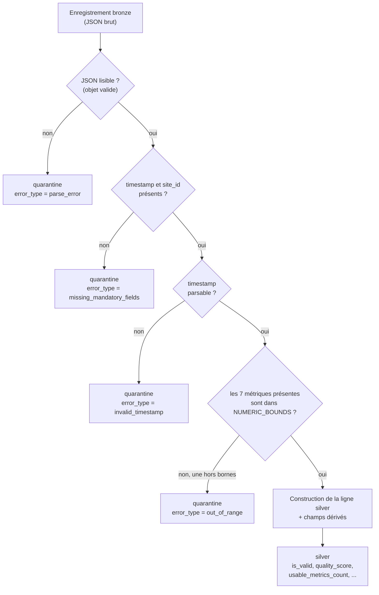
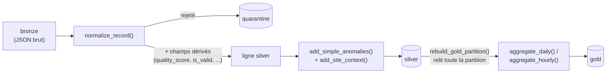

# Transformation des données — champs & règles

# Transformation des données — champs & règles (`quality.py`)

Cette page détaille ce qui se passe **dans** `etl/quality.py` : les règles précises qui transforment un enregistrement bronze brut en ligne silver exploitable (ou le rejettent en quarantaine), et comment le gold est agrégé ensuite. Vue d'ensemble du pipeline (extraction, orchestration, chargement) : voir la page parente **ETL — Pipeline de données**.

## Le principe directeur

**Ne jamais inventer une donnée.** Un capteur en panne produit un trou visible et daté (`is_valid=false`), jamais un zéro. Une moyenne sans aucune mesure vaut `NULL`, jamais `0`. Toutes les règles ci-dessous découlent de ce principe.

## Arbre de décision : silver ou quarantaine ?

Chaque enregistrement bronze passe par `normalize_record()`, qui l'oriente vers silver ou quarantaine selon 4 points de sortie possibles :

**Point important** : une métrique *absente* (`null`, panne capteur simulée) n'est **pas** un rejet — la ligne part quand même en silver, juste avec cette métrique à `None`. Seule une métrique *présente mais physiquement impossible* (5000 V, facteur de puissance à 3) fait partir **tout l'enregistrement** en quarantaine.

## Les 4 types de rejet en quarantaine

| `error_type` | Déclencheur | Où dans le code |
|------------|-------------|-----------------|
| `parse_error` | JSON illisible, ou pas un objet | `fetch_record`  |
| `missing_mandatory_fields` | `timestamp` ou `site_id` absent | `normalize_record` |
| `invalid_timestamp` | `timestamp` présent mais non interprétable | `normalize_record` |
| `out_of_range` | une métrique présente hors de `NUMERIC_BOUNDS` (ex. tension à 5000 V) | `check_ranges`  |

Une ligne de quarantaine garde `site_id` et `record_date` **si lisibles** (partition `unknown` sinon), pour rester interrogeable comme silver et gold.

## Les bornes physiques (`NUMERIC_BOUNDS`)

Volontairement larges — on vise l'impossible, pas l'inhabituel :

| Métrique | Borne basse | Borne haute |
|----------|-------------|-------------|
| `consumption_kw` | 0           | 100 000     |
| `consumption_kwh` | 0           | 100 000     |
| `voltage_v` | 0           | 1 000       |
| `current_a` | 0           | 100 000     |
| `power_factor` | \-1         | 1           |
| `temperature_celsius` | \-60        | 90          |
| `humidity_percent` | 0           | 100         |

## Schéma des champs — `measurements_silver`

| Champ | Origine | Description |
|-------|---------|-------------|
| `source_key` | bronze  | Clé de l'objet bronze d'origine — garantit l'idempotence (rejeu sans doublon) |
| `timestamp` | brut, parsé | Horodatage de la mesure, converti en UTC |
| `site_id` / `site_type` | brut    | Identifiant et type du site |
| `consumption_kw`, `consumption_kwh`, `voltage_v`, `current_a`, `power_factor`, `temperature_celsius`, `humidity_percent` | brut (`safe_float`) | Les 7 métriques mesurées ; `None` si absente ou invalide, jamais 0 par défaut |
| `null_reasons` | brut, normalisé | Raisons de métriques nulles fournies par la source (ex. `network_loss`) |
| `data_quality` | brut    | Niveau annoncé par la source : `good` / `partial` / `degraded` / `critical` / inconnu |
| `record_date` | dérivé  | Date de la mesure — clé de partition |
| `record_hour` | dérivé  | Heure de la mesure, arrondie |
| `missing_fields` | dérivé  | Liste des métriques absentes sur les 7 |
| `usable_metrics_count` | dérivé  | Nombre de métriques exploitables (7 − `missing_fields`) |
| `quality_score` | dérivé, calculé | Score 0–100, détail ci-dessous |
| `is_valid` | dérivé  | `usable_metrics_count > 0` — porte au moins une mesure exploitable |
| `has_anomaly` | dérivé, recalculé au niveau partition | Détection z-score / delta, voir plus bas |
| `consumption_change_pct` | dérivé, recalculé au niveau partition | Variation absolue vs la mesure précédente du même site |
| `capacity_kw` | contexte site (table Postgres `sites`) | Puissance souscrite du site |
| `load_percent` | dérivé  | `consumption_kw / capacity_kw * 100` — seul indicateur de charge comparable entre sites |
| `ingested_at` | dérivé  | Horodatage de traitement (≠ `timestamp`, qui est l'horodatage de la mesure) |

## Le score de qualité (`compute_quality_score`)

Part de 100, retire des pénalités, borné entre 0 et 100 :

| Pénalité | Condition | Points |
|----------|-----------|--------|
| Qualité source | `data_quality = good` | 0      |
|          | `partial` | −10    |
|          | `degraded` | −25    |
|          | `critical` | −45    |
|          | inconnu / absent | −5     |
| Métrique optionnelle manquante | par métrique parmi `voltage_v`, `current_a`, `power_factor`, `temperature_celsius`, `humidity_percent` | −4 chacune |
| `consumption_kw` manquant |           | −20    |
| `timestamp` / `site_id` manquant | (en pratique jamais atteint ici : la ligne serait déjà en quarantaine) | −30 chacun |

> L'ordre des pénalités par niveau de qualité a été corrigé explicitement : `critical` (réseau coupé, 7 métriques nulles) doit être **pire** que `degraded`, pas mieux noté par accident de logique par défaut.

## Détection d'anomalies (`add_simple_anomalies`)

Deux signaux combinés en OR :

* **Z-score** : `|consumption_kw − moyenne_site| > 3 × écart-type_site`
* **Delta** : variation absolue `> 35 %` par rapport à la mesure précédente du même site

`has_anomaly = zscore_flag OR delta_flag`

**Piège à connaître** : ce calcul a besoin d'un historique (moyenne, écart-type, valeur précédente) sur la **partition entière**. En collecte temps réel, un lot vaut souvent 1 ligne par site : le calcul écrit en silver à ce moment-là est donc quasi toujours `False`. Le recalcul est **refait en entier** sur toute la partition lors du passage gold (`rebuild_gold_partition`), où il a enfin un sens statistique.

## Agrégation gold (`aggregate_daily` / `aggregate_hourly`)

### Compteurs (`GOLD_COUNTERS`)

Se partitionnent **sans reste** : `good + partial + degraded + critical + unknown = records_count`.

| Compteur | Calcul |
|----------|--------|
| `records_count` | nombre total de lignes silver de la partition |
| `usable_count` | lignes avec au moins une métrique exploitable |
| `empty_count` | lignes sans aucune métrique exploitable |
| `good_count` / `partial_count` / `degraded_count` / `critical_count` | lignes par niveau `data_quality` |
| `unknown_count` | `data_quality` hors des 4 niveaux connus |
| `missing_consumption_count` | lignes où `consumption_kw` est absent |
| `anomaly_count` | lignes avec `has_anomaly = true` |

### Métriques (`GOLD_METRICS`)

| Métrique | Calcul |
|----------|--------|
| `avg` / `min` / `max_consumption_kw` | moyenne / min / max, NaN ignorés |
| `total_consumption_kwh` | **somme qui vaut NaN** (pas 0) si aucune valeur du groupe n'existe |
| `avg` / `max_load_percent` | à partir de `load_percent` |
| `capacity_kw` | constante par site |
| `avg_voltage_v`, `avg_current_a`, `avg_power_factor`, `avg_temperature_celsius`, `avg_humidity_percent` | moyennes |
| `avg_quality_score` | moyenne du `quality_score` silver |

### Spécifique au grain journalier

* `covered_hours` : nombre d'heures **distinctes** avec au moins une mesure exploitable (pas le nombre de lignes — 6 relevés à la même heure ne comptent que pour 1 heure couverte)
* `expected_hours` = 24
* `completeness_pct` = `covered_hours / 24 * 100`

### Spécifique au grain horaire

`fill_hourly_grid` complète **toujours** à 24 lignes par `(date, site)`, même les heures sans aucun relevé (`records_count = 0`, métriques à `NaN`, `capacity_kw` propagée) — pour qu'un modèle de série temporelle ne recolle jamais deux heures non adjacentes sans le savoir.

## Résumé visuel du flux complet

