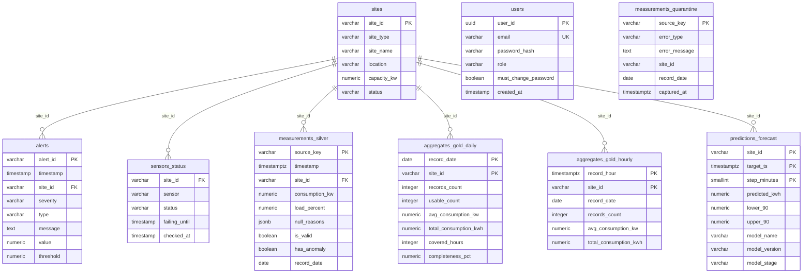

# PostgreSQL — Schéma

# `infra/postgres/` — Base de données

PostgreSQL 16. **Le schéma fait foi ici**, pas dans les modèles SQLAlchemy de `api/` — ces derniers n'en sont qu'un miroir en lecture et ne créent aucune table.

Le service `postgres` est déclaré dans le [`compose.yaml`](../../compose.yaml) de la racine ; les variables `POSTGRES_*` viennent du `.env` de la racine.

## Schéma

Les scripts de [`init/`](init/) sont montés sur `/docker-entrypoint-initdb.d` et rejoués par l'image PostgreSQL **dans l'ordre alphabétique, uniquement à la toute première initialisation du volume** `**pgdata**`. Tous sont idempotents (`IF NOT EXISTS`, `ON CONFLICT`).

| Fichier | Tables | Alimentée par |
|---------|--------|---------------|
| `01_core.sql` | `sites`, `alerts`, `sensors_status`, `users` | `etl-alerts`, `api` |
| `02_silver.sql` | `measurements_silver` | `etl-collect` (réplique du silver MinIO) |
| `03_gold.sql` | `aggregates_gold_daily`, `aggregates_gold_hourly` | `etl-collect` (réplique du gold MinIO) |
| `04_seed_sites.sql` | *(seed de* `*sites*`*)* | snapshot manuel de l'API Mock IoT |
| `05_quarantine.sql` | `measurements_quarantine` | `etl-collect` (réplique du bucket quarantine) |
| `06_predictions.sql` | `predictions_forecast` | `ml-predict`  |

Les tables `measurements_*` et `aggregates_*` sont des **répliques** : MinIO reste la source de vérité, PostgreSQL n'existe que pour rendre ces données interrogeables en SQL par l'API. Elles sont écrites par [`etl/postgres_writer.py`](../../etl/postgres_writer.py).

`users` et `sites`, en revanche, ne sont régénérables depuis rien : ce sont les deux seules tables couvertes par la sauvegarde ([`infra/backup/`](../backup/)).

## Démarrer

```bash
# depuis la racine du dépôt
cp .env.example .env          # puis renseigner POSTGRES_PASSWORD
docker compose up -d postgres
```

Le conteneur expose PostgreSQL sur le port hôte **5433** — et non 5432 — pour éviter tout conflit avec une instance PostgreSQL déjà installée localement.

## Se connecter

```bash
docker exec -it enervision-postgres psql -U ev_admin -d ev_monitoring
```

Depuis un client externe (DBeaver, pgAdmin, DataGrip) :

| Champ | Valeur |
|-------|--------|
| Hôte  | `localhost` |
| Port  | `5433` |
| Base  | `ev_monitoring` |
| Utilisateur / mot de passe | valeurs du `.env` |

Quelques vérifications utiles :

```bash
# Lister les tables
docker exec -it enervision-postgres psql -U ev_admin -d ev_monitoring -c "\dt"

# Vérifier que le seed des sites est passé
docker exec -it enervision-postgres psql -U ev_admin -d ev_monitoring -c "SELECT count(*) FROM sites;"
```

## Rejouer les scripts sur un volume existant

Les scripts de `init/` ne sont **pas** rejoués sur un volume déjà initialisé. Pour les appliquer à une base existante (ils sont idempotents) :

```bash
# depuis la racine du dépôt
cat infra/postgres/init/*.sql | docker exec -i enervision-postgres psql -U ev_admin -d ev_monitoring
```

## Repartir d'une base vide

> **Destructif** : `-v` supprime le volume `pgdata` et donc toutes les données, comptes compris.

```bash
docker compose down -v
docker compose up -d postgres
```

## Changements de schéma

Il n'y a pas encore de migrations (Alembic) : les scripts d'`init/` n'étant rejoués que sur un volume vide, **tout ajout de colonne sur une base existante se fait à la main**. La procédure et les précautions à prendre en production sont décrites dans *Changements de schéma sur une base existante* de [`../DEPLOYMENT.md`](../DEPLOYMENT.md).

Règle pratique : modifier le script d'`init/` concerné **et** appliquer le `ALTER TABLE` correspondant sur les bases déjà déployées, dans le même changement.

## Schéma entité-relation



`measurements_quarantine` n'a volontairement **pas** de clé étrangère vers `sites` : un enregistrement rejeté peut justement porter un `site_id` inconnu ou illisible.