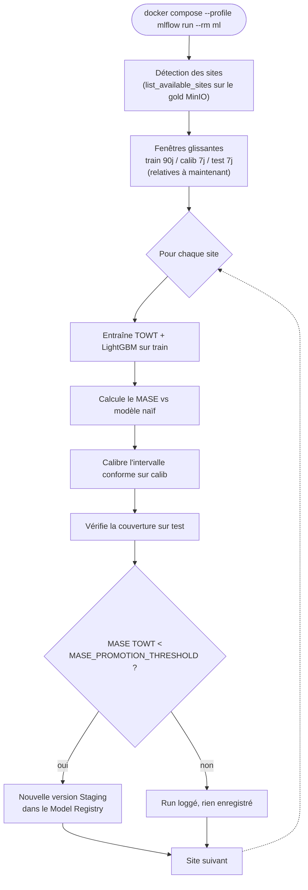
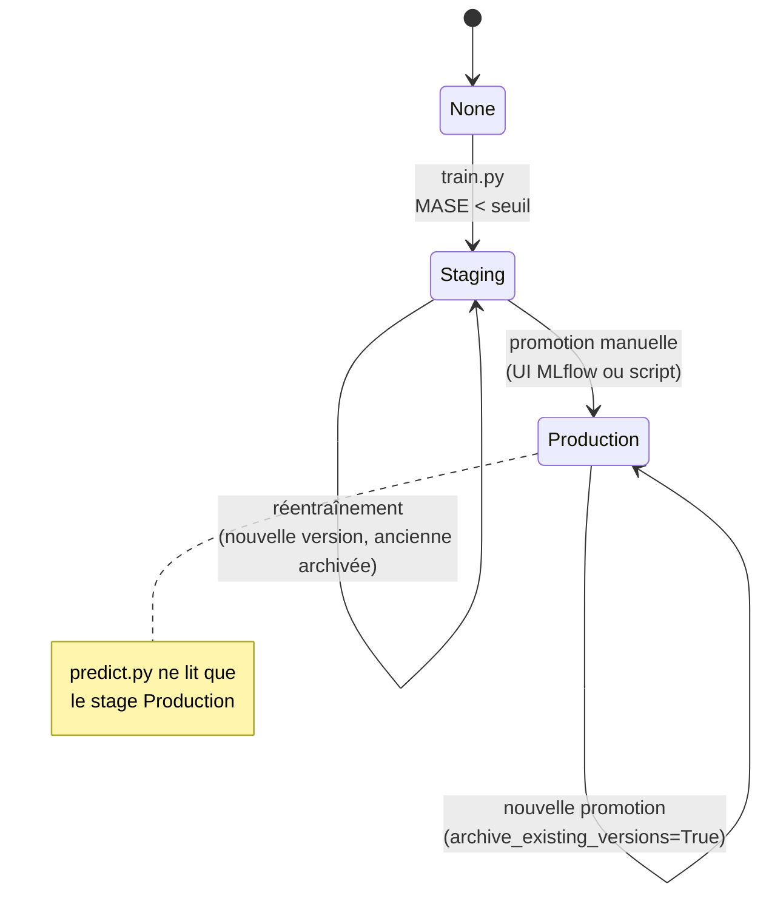

# ML — Prévision & MLflow

# `ml/` — Prévision de consommation

Modèles de prévision de charge (kW/kWh) par site, suivis dans MLflow. Deux sources d'entraînement possibles : un CSV synthétique (la seule base exploitable aujourd'hui) et le gold MinIO réel (pipeline prêt, mais bloqué par le volume de données — voir plus bas).

## Structure

```
ml/
├── models/         Algorithmes : naive.py (plancher), towt.py, challenger.py (LightGBM)
├── core/           Utilitaires partagés :
│                     data.py             accès au gold MinIO + détection des sites
│                     evaluation.py       MASE, intervalle conforme, couverture
│                     features.py         features d'inférence
│                     postgres_store.py   lecture/écriture PostgreSQL
│                     mlflow_tracking.py  log des runs + promotion Staging
│                     list_gold_keys.py   utilitaire de fouille du bucket (dev)
├── scripts/        train_csv_experiment.py  comparaison des modèles sur CSV
│                   train_v1_csv.py          persistance MLflow des champions retenus
├── reports/        RAPPORT_*.md (versionnés) + report_data.json (résultats d'expérience)
├── train.py        Réentraînement sur gold réel, fenêtres train/calib/test glissantes
└── predict.py      Inférence batch : registry MLflow → table predictions_forecast
```

> `**ml/data/csv/**` **n'est pas dans le dépôt** (ignoré par Git : donnée, même synthétique, ne se versionne pas ici). Les scripts `scripts/*.py` en dépendent et échoueront sur un clone neuf tant que ce dossier n'a pas été reconstitué — `reports/report_data.json` est la trace versionnée de leurs résultats.

## Trois modèles, un plancher

| Modèle | Fichier | Rôle |
|--------|---------|------|
| Naïf   | `models/naive.py` | **Plancher** : toute autre approche doit faire mieux, sinon elle ne sert à rien |
| TOWT   | `models/towt.py` | Champion : régression calendaire, `C(time_of_week)` = 168 créneaux hebdomadaires |
| LightGBM | `models/challenger.py` | Challenger : gradient boosting sur features enrichies |

La qualité se lit en **MASE** (erreur rapportée à celle du naïf) : `MASE < 1` = mieux que le plancher. Les prévisions sont accompagnées d'un **intervalle conforme** calibré sur la fenêtre `calib` et vérifié sur `test`.

## Réentraînement sur gold réel

```bash
docker compose --profile mlflow run --rm ml
```

Déroulé d'un run :


1. **Détection des sites** — liste les `site_id` réellement présents dans le gold MinIO des derniers jours (`core/data.py::list_available_sites`), aucune liste codée en dur.
2. **Fenêtres glissantes** — train/calib/test calculés par rapport à *maintenant* (90/7/7 jours par défaut, réglables via `TRAIN_WINDOW_DAYS` / `CALIB_WINDOW_DAYS` / `TEST_WINDOW_DAYS`), et non des dates figées : sinon un réentraînement périodique repasserait indéfiniment sur la même fenêtre.
3. **Par site** — entraîne TOWT + LightGBM sur `train`, calcule le MASE contre le naïf, calibre l'intervalle conforme sur `calib`, vérifie la couverture sur `test`.
4. **Décision de promotion** (fusible, ADR-04) — si `MASE TOWT < MASE_PROMOTION_THRESHOLD`, une nouvelle version est enregistrée dans le Model Registry (`enervision-forecast-<site>`, stage `Staging`, version précédente archivée). Sinon le run est loggé mais rien n'est enregistré.
5. Un site en échec (données insuffisantes, etc.) n'empêche jamais les autres.

### Automatiser le réentraînement

Volontairement non planifié aujourd'hui : le gold n'a pas encore assez d'historique pour qu'un réentraînement automatique produise autre chose que des échecs (voir ci-dessous).

Quand ce sera le cas, la planification devra se faire par un **scheduler déclaré dans** `**compose.yaml**` (par exemple [ofelia](https://github.com/mcuadros/ofelia), qui pilote des conteneurs via le socket Docker et se configure par labels), et non par une crontab système installée à la main sur le serveur : `docker compose up` doit rester suffisant pour tout activer. Créneau raisonnable : le 1er de chaque mois vers 4 h UTC, décalé du backup (3 h) et du recalcul gold quotidien (00 h 15) pour ne pas cumuler la charge.

### Ce qui bloque encore, concrètement

TOWT est calendaire : 168 créneaux, un par heure de la semaine. La fenêtre `train` a donc besoin d'**au moins 7 jours pleins** pour avoir une chance de tous les couvrir ; en dessous, `calib` / `test` tombent forcément sur une heure-de-la-semaine jamais vue à l'entraînement et la prédiction échoue. Avec les fenêtres par défaut (90/7/7 j), cela demande **\~3 mois d'historique réel** avant qu'un run aboutisse vraiment.

Rien à corriger dans le code : c'est un état transitoire, le temps que la collecte accumule assez de gold.

## Utilisation en ligne de commande

```bash
cd ml
pip install -r requirements.txt

# Comparer les modèles candidats sur le CSV — régénère reports/report_data.json
python scripts/train_csv_experiment.py

# Persister les champions retenus dans MLflow (stage Staging)
MLFLOW_TRACKING_URI=sqlite:///mlflow.db python scripts/train_v1_csv.py

# Prévoir les prochaines heures pour tous les sites et écrire en base
python predict.py

# Contrôler le modèle contre le gold réel sans rien écrire
python predict.py --check --days 14 --probe-tz
```

Configuration : le `.env` de la **racine** du projet (pas de `.env` local à `ml/`).

### Deux limites d'inférence à connaître

* **Pas horaire uniquement.** Les champions étant calendaires (168 créneaux par semaine), ils sont structurellement incapables de descendre sous l'heure. L'horizon, lui, est libre : aucun retard de consommation n'entre dans ces modèles, prédire +1 h ou +7 j est le même calcul.
* **Les sites dont le champion est LightGBM ne sont pas inférables en l'état** : leurs features incluent `solar_irradiance_wm2`, que ni `aggregates_gold_hourly` ni `measurements_silver` ne portent. `predict.py` les écarte explicitement et traite les autres.

## Promouvoir un modèle en Production

Aucune promotion `Staging` → `Production` n'est automatique — décision volontaire : un modèle de prévision énergétique sans supervision humaine est un risque métier, pas seulement technique.

`predict.py` lit le stage `Production` par défaut (`PREDICT_MODEL_STAGE`) : tant qu'aucune version n'y est promue, il ne trouve rien et n'écrit aucune prévision. **C'est l'état normal, pas une panne.**

Une fois un candidat jugé satisfaisant (MASE, marge conforme, couverture — visibles dans l'UI MLflow, `http://localhost:5000` en local) :


1. UI MLflow → **Models** → `enervision-forecast-<site>` → la version voulue → **Stage** → *Transition to* **Production** ;
2. ou par script :

   ```python
   from mlflow.tracking import MlflowClient
   
   client = MlflowClient()
   client.transition_model_version_stage(
       name="enervision-forecast-SITE001",
       version=3,
       stage="Production",
       archive_existing_versions=True,
   )
   ```

`archive_existing_versions=True` retire automatiquement l'ancienne version de Production. Le prochain cycle de `ml-predict` (cron horaire) la prend en compte sans redéploiement.

## État actuel

Tous les modèles persistés sont en `Staging`, **aucun en** `**Production**` : ils ont été entraînés sur CSV synthétique et ne sont pas validés sur données réelles.

* [`reports/RAPPORT_ENTRAINEMENT.md`](reports/RAPPORT_ENTRAINEMENT.md) — comparaison des modèles
* [`reports/RAPPORT_PERSISTANCE_V1.md`](reports/RAPPORT_PERSISTANCE_V1.md) — modèles persistés

## Note pour les contributeurs

Les points d'entrée (`train.py`, `predict.py`, `scripts/*.py`) amorcent leur `sys.path` et chargent le `.env` racine **avant** d'importer `core/` et `models/`. Leurs imports ne peuvent donc pas remonter en tête de fichier : `E402` est neutralisé pour ces fichiers dans `pyproject.toml`. Le reste de `ml/` est linté et formaté comme tout le dépôt — voir [`CONTRIBUTING.md`](../CONTRIBUTING.md).

`predict.py` importe `LGBM_FEATURES`, `SITES`, `predict_lgbm` et `predict_ols` depuis `scripts/train_csv_experiment.py` : ce script d'expérimentation est donc une **dépendance d'exécution de l'inférence**, pas un simple outil de laboratoire. Déplacer ces symboles vers `core/` serait le bon nettoyage suivant, une fois `ml/` couvert par des tests.

## Schémas

### Déroulé d'un réentraînement



### Cycle de vie d'un modèle dans le Model Registry

