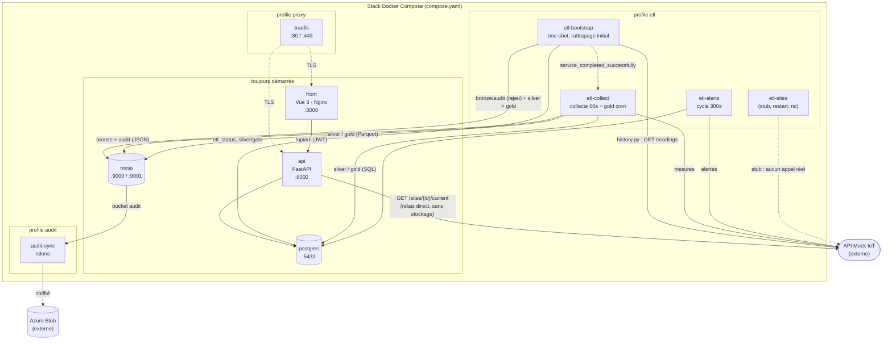
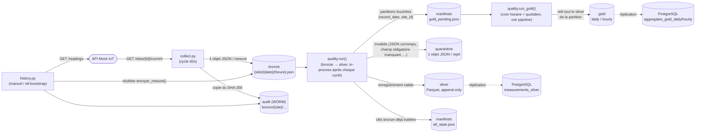
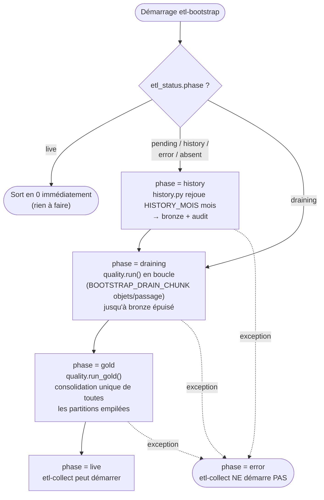
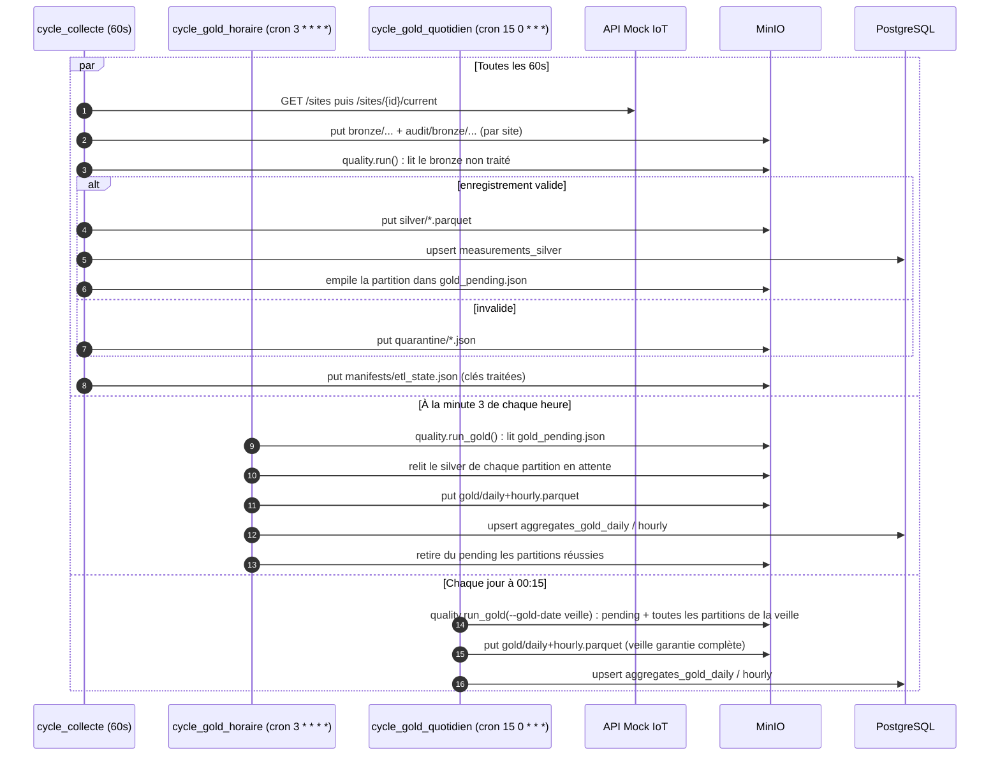
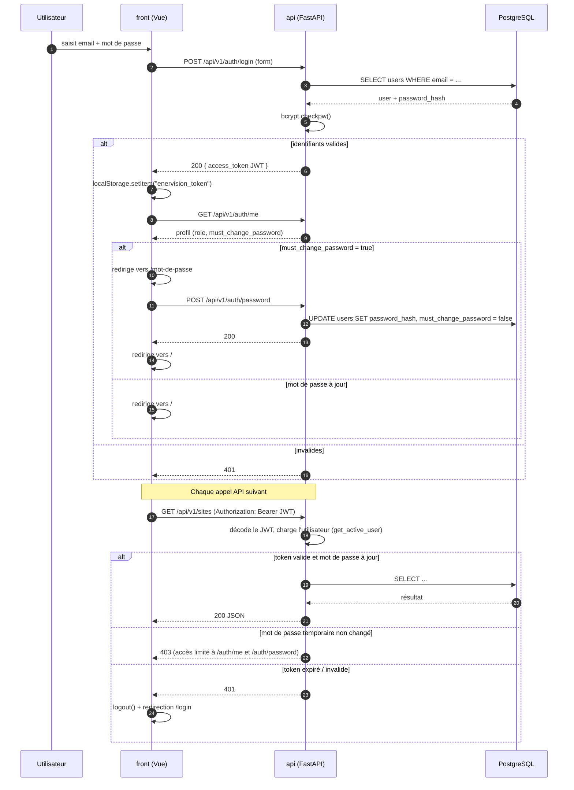

# EnerVision

Plateforme de suivi et d'optimisation énergétique : collecte de mesures IoT,
pipeline de qualité de données (bronze → silver → gold), API REST et interface web.

## Architecture

Application multi-services conteneurisée, orchestrée par un unique `compose.yaml`
à la racine.

| Service | Dossier | Rôle | Stack |
|---|---|---|---|
| **api** | [`api/`](api/) | API REST (auth, comptes utilisateurs, alertes, sites, capteurs) | FastAPI, SQLAlchemy, PostgreSQL |
| **front** | [`front/`](front/) | Interface web (dashboard, alertes, capteurs, administration des comptes) | Vue 3, Vite, servi par Nginx en prod |
| **etl** | [`etl/`](etl/) | Collecte des mesures + qualité de données | Python, APScheduler, boto3 |
| **postgres** | — | Base de données | PostgreSQL 16 |
| **minio** | — | Stockage objet S3 (bronze/silver/gold/quarantine/audit) | MinIO |
| **audit-sync** | [`infra/audit-sync/`](infra/audit-sync/) | Réplication chiffrée MinIO → Azure Blob | rclone |
| **traefik** | [`infra/traefik/`](infra/traefik/) | Reverse proxy TLS | Traefik v2 |

### Diagrammes

#### Vue d'ensemble des services



`etl-collect` appelle `quality.py` en in-process, sur trois plannings distincts (voir
[`etl/collect.py`](etl/collect.py)) : la collecte + promotion silver toutes les
`INTERVALLE_SECONDES` (60s par défaut), et deux recalculs gold séparés, parce que
relire tout le silver d'une partition à chaque cycle de collecte faisait déborder son
intervalle.

#### Flux de données (bronze → silver → gold)



MinIO reste la source de vérité ; les mêmes lignes silver/gold sont répliquées dans
PostgreSQL pour être interrogeables en SQL par l'API. Une panne PostgreSQL n'interrompt
pas l'écriture MinIO. Le gold n'est **pas** recalculé dans le même passage que le
silver : chaque partition `(record_date, site_id)` touchée est empilée dans
`gold_pending.json` et reprise par un passage `--gold-only` dédié (voir plus bas).

#### Rattrapage initial (`etl-bootstrap`)

Conteneur one-shot qui rejoue l'historique puis draine tout le bronze existant avant
que `etl-collect` ne passe en temps réel — `etl-collect` attend son
`service_completed_successfully` pour démarrer. L'état (idempotent) vit dans la table
PostgreSQL `etl_status`.



Sur un redémarrage après un plantage, `history`/`error` refont l'historique (idempotent),
`draining` reprend le drainage là où l'état incrémental s'était arrêté, `gold` refait la
consolidation. Un échec de consolidation gold ne bloque pas la mise en `live` : les
partitions en échec restent en file et le cron horaire de `etl-collect` les reprend.

#### Pipeline ETL — régime permanent



Les trois jobs tournent avec `max_instances=1` + `coalesce=True` : si un passage déborde,
les occurrences manquées sont sautées plutôt qu'empilées. Une erreur dans `quality.py`
est interceptée et loguée sans jamais arrêter le planificateur (voir `lancer_quality()`
dans [`etl/collect.py`](etl/collect.py)).

#### Authentification et requêtes API



Le rôle (`viewer` / `operator` / `admin`) est encodé dans le JWT et vérifié par
`require_role` / `require_min_role` (voir [`api/auth.py`](api/auth.py)) sur les routes qui
en ont besoin, par ex. `POST /api/v1/users` réservé aux admins. Un compte dont
`must_change_password` est vrai n'a accès à rien d'autre que `/auth/me` et
`/auth/password` (403 sur le reste, voir `get_active_user`).

## Démarrage local

Prérequis : Docker Desktop en cours d'exécution.

```bash
cp .env.example .env          # valeurs de dev déjà utilisables telles quelles
docker compose up -d --build  # cœur : postgres, minio, api, front
```

| | URL |
|---|---|
| Front | http://localhost:3000 |
| API (OpenAPI) | http://localhost:8000/docs |
| Console MinIO | http://localhost:9001 |
| PostgreSQL | `localhost:5433` |

Services optionnels, derrière des profils Compose :

```bash
docker compose --profile etl up -d --build                        # + pipeline ETL
docker compose --profile etl --profile audit --profile proxy up -d --build   # tout
```

Créer le premier compte admin (aucune route publique de création) :

```bash
docker compose exec api python -m api.create_admin --email admin@enervision.fr
```

Le schéma amorce aussi un compte `admin@enervision.io` / `admin`, marqué « mot de passe
à changer » : la première connexion impose donc de choisir un vrai mot de passe.

## Comptes et rôles

Trois rôles, par privilège croissant : `viewer` (lecture), `operator`, `admin`.

Un **admin** gère les comptes depuis la page *Utilisateurs* du front (création,
changement de rôle, réinitialisation de mot de passe, suppression) — routes
`/api/v1/users`, toutes réservées au rôle `admin`.

Un compte créé par un admin part avec un **mot de passe temporaire** : tant qu'il n'a
pas été remplacé via `POST /api/v1/auth/password`, l'API répond 403 sur tout le reste
(`must_change_password`) et le front redirige vers l'écran de changement de mot de
passe. Même mécanisme après une réinitialisation par un admin.

## Configuration

Toute la configuration passe par un seul fichier `.env` à la racine
(voir [`.env.example`](.env.example)). Le front a en plus un
[`front/.env.example`](front/.env.example) pour les variables `VITE_*`.

En Compose, le service `api` force `POSTGRES_HOST=postgres` / `POSTGRES_PORT=5432` ;
les valeurs `localhost:5433` du `.env` ne servent qu'à lancer l'API hors Docker.

## Tests

```bash
# API
pip install -r api/requirements-dev.txt
pytest api/tests

# ETL
pip install -r etl/requirements-dev.txt
cd etl && pytest

# Front
cd front && npm install && npm test
```

Les `requirements.txt` ne contiennent que le runtime (ce qui est installé dans les
images) ; pytest & co. sont dans les `requirements-dev.txt`.

## Qualité de code

`pre-commit` (ruff lint + format sur `api/` et `etl/`, normalisation des fins de
ligne) :

```bash
pip install pre-commit
pre-commit install
pre-commit run --all-files
```

## Déploiement

CI/CD GitHub Actions sur push `dev` : voir [`infra/DEPLOYMENT.md`](infra/DEPLOYMENT.md).

## Pistes connues (non traitées)

- **Migrations DB** : le schéma vit dans [`infra/postgres/init/`](infra/postgres/init/)
  (fait foi), les modèles SQLAlchemy restent partiels (`users`, `alerts`, `sites`,
  `measurements_silver`, `aggregates_gold_*`). Ces scripts n'étant rejoués que sur un
  volume vide, tout ajout de colonne se passe à la main sur une base existante (voir
  *Changements de schéma sur une base existante* dans
  [`infra/DEPLOYMENT.md`](infra/DEPLOYMENT.md)). Introduire Alembic quand le modèle
  se stabilise.
- **`etl/sites.py` reste un stub** : le service `etl-sites` (`restart: "no"`) ne
  peuple pas encore la table `sites` automatiquement. Côté API, `GET /api/v1/sites`
  et `GET /api/v1/sites/{id}/current` existent désormais ([`api/routers/sites.py`](api/routers/sites.py)).
- **Tests front dans la CI** : `npm test` (Vitest) existe et passe en local, mais `.github/workflows/deploy-dev.yml` ne fait encore qu'un `npm run build` — l'ajouter au job `build-front`.
