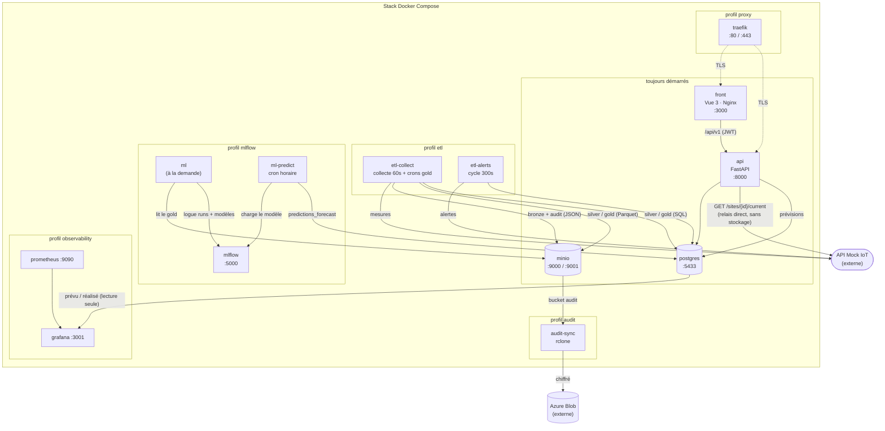
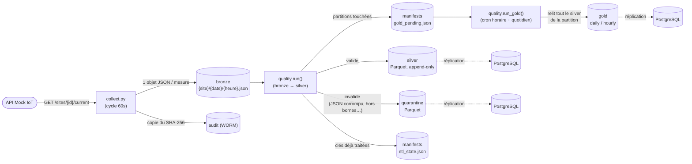
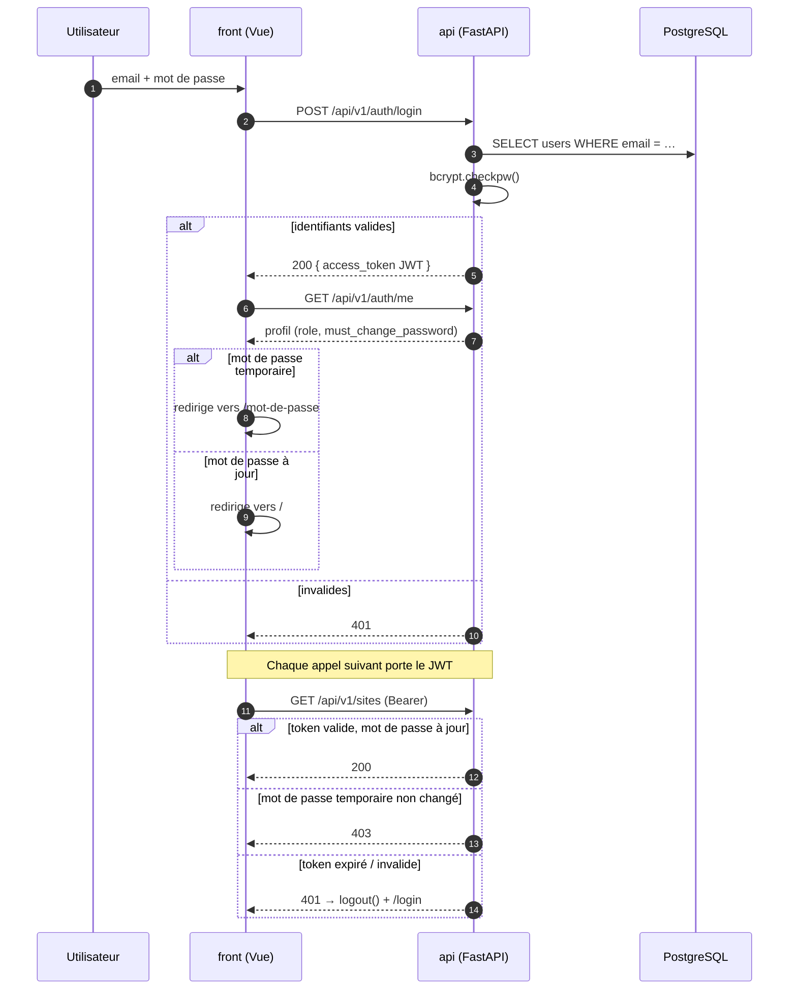

# EnerVision

Plateforme de suivi et d'optimisation énergétique : collecte de mesures IoT, pipeline de
qualité de données (bronze → silver → gold), API REST, interface web et prévision de
consommation.

```bash
cp .env.example .env          # les valeurs de dev sont utilisables telles quelles
docker compose up -d --build  # http://localhost:3000
```

---

## Sommaire

- [Ce que fait la plateforme](#ce-que-fait-la-plateforme)
- [Architecture](#architecture)
- [Démarrage local](#démarrage-local)
- [Comptes et rôles](#comptes-et-rôles)
- [Documentation par domaine](#documentation-par-domaine)
- [Configuration](#configuration)
- [Tests](#tests)
- [Qualité de code](#qualité-de-code)
- [Déploiement](#déploiement)
- [Pistes connues](#pistes-connues)

---

## Ce que fait la plateforme

Une API Mock IoT externe expose des relevés de consommation pour 7 sites (bureaux, usines,
data center, hôpital, centre commercial). EnerVision :

1. **collecte** ces relevés en continu et les archive tels quels (couche *bronze*) ;
2. **valide et normalise** chaque mesure, met les rejets en quarantaine (couche *silver*) ;
3. **agrège** aux grains horaire et journalier (couche *gold*) ;
4. **restitue** le tout dans une interface web, avec les alertes et l'état des capteurs ;
5. **prévoit** la consommation à venir à partir de modèles suivis dans MLflow.

Le fil conducteur du pipeline : **ne jamais inventer une donnée**. Un capteur muet produit
un trou explicite et daté, pas un zéro — voir [Trous de données](etl/README.md#trous-de-données--ce-qui-nest-jamais-inventé).

## Architecture

Application multi-services conteneurisée, orchestrée par un unique
[`compose.yaml`](compose.yaml) à la racine.

| Service | Dossier | Rôle | Stack | Profil |
|---|---|---|---|---|
| **front** | [`front/`](front/) | Interface web | Vue 3, Vite, Nginx | *(toujours)* |
| **api** | [`api/`](api/) | API REST | FastAPI, SQLAlchemy | *(toujours)* |
| **postgres** | [`infra/postgres/`](infra/postgres/) | Base de données | PostgreSQL 16 | *(toujours)* |
| **minio** | [`infra/minio/`](infra/minio/) | Stockage objet S3 | MinIO | *(toujours)* |
| **etl-collect** | [`etl/`](etl/) | Collecte + qualité de données | Python, APScheduler | `etl` |
| **etl-alerts** | [`etl/`](etl/) | Collecte des alertes | Python, APScheduler | `etl` |
| **mlflow** | [`infra/mlflow/`](infra/mlflow/) | Tracking + Model Registry | MLflow | `mlflow` |
| **ml** | [`ml/`](ml/) | Réentraînement (à la demande) | LightGBM, statsmodels | `mlflow` |
| **ml-predict** | [`ml/`](ml/) | Inférence batch horaire | MLflow, pandas | `mlflow` |
| **audit-sync** | [`infra/audit-sync/`](infra/audit-sync/) | Réplication chiffrée → Azure Blob | rclone | `audit` |
| **traefik** | [`infra/traefik/`](infra/traefik/) | Reverse proxy TLS | Traefik v2 | `proxy` |
| **prometheus**, **grafana**, **node-exporter**, **cadvisor** | [`infra/`](infra/) | Observabilité | — | `observability` |

### Vue d'ensemble



### Flux de données



**MinIO est la source de vérité.** Les mêmes lignes sont répliquées dans PostgreSQL pour
être interrogeables en SQL par l'API ; une panne PostgreSQL n'interrompt pas l'écriture
MinIO. Le détail du découpage des plannings est expliqué dans
[`etl/README.md`](etl/README.md#pourquoi-le-gold-est-recalculé-à-part).

### Authentification



## Démarrage local

**Prérequis** : Docker Desktop en cours d'exécution.

```bash
cp .env.example .env
docker compose up -d --build
```

| | URL | Identifiants |
|---|---|---|
| Front | http://localhost:3000 | `admin@enervision.io` / `admin` |
| API (OpenAPI) | http://localhost:8000/docs | — |
| Console MinIO | http://localhost:9001 | voir `.env` |
| PostgreSQL | `localhost:5433` | voir `.env` |

Le compte d'amorçage est marqué « mot de passe à changer » : la première connexion impose de
choisir un vrai mot de passe.

### Services optionnels (profils Compose)

```bash
docker compose --profile etl up -d --build              # pipeline ETL
docker compose --profile observability up -d --build    # Prometheus / Grafana / exporters
docker compose --profile mlflow up -d --build           # MLflow + inférence
docker compose --profile proxy up -d --build            # Traefik (TLS)
docker compose --profile audit up -d --build            # réplication chiffrée vers Azure

# Tout à la fois
docker compose --profile etl --profile observability --profile mlflow \
               --profile audit --profile proxy up -d --build
```

| Profil | Ce qu'il ajoute |
|---|---|
| `etl` | La donnée commence à arriver : sans lui, la base reste vide |
| `observability` | Grafana sur http://localhost:3001 (`admin`/`admin`), datasources et dashboards provisionnés : « Serveur » (hôte et conteneurs, via Prometheus) et « Modèles ML » (qualité des prévisions, via Postgres — demande `GRAFANA_DB_*`, cf. [`.env.example`](.env.example)) |
| `mlflow` | MLflow sur http://localhost:5000 + prévisions horaires |
| `audit` | Réplication chiffrée vers Azure — demande les secrets `AZURE_*` |
| `proxy` | Traefik + Let's Encrypt — pour un déploiement exposé, pas en local |

> VS Code : les tâches Docker les plus courantes sont disponibles via
> *Terminal → Exécuter la tâche…* ([`.vscode/tasks.json`](.vscode/tasks.json)).

## Comptes et rôles

Trois rôles par privilège croissant : `viewer` (lecture), `operator`, `admin`.

Un **admin** gère les comptes depuis la page *Utilisateurs* du front — création, changement
de rôle, réinitialisation, suppression. Ces routes (`/api/v1/users`) lui sont réservées.

Un compte créé par un admin part avec un **mot de passe temporaire** : tant qu'il n'a pas
été remplacé, l'API répond `403` sur tout sauf `/auth/me` et `/auth/password`, et le front
redirige vers l'écran de changement. Même mécanisme après une réinitialisation.

Créer un admin supplémentaire (aucune route publique de création n'existe) :

```bash
docker compose exec api python -m api.create_admin --email admin@enervision.fr
```

## Documentation par domaine

Chaque dossier documente son propre périmètre :

| Document | Sujet |
|---|---|
| [`api/README.md`](api/README.md) | Endpoints, authentification, rôles, configuration |
| [`etl/README.md`](etl/README.md) | Couches bronze/silver/gold, plannings, traitement des trous |
| [`front/README.md`](front/README.md) | Routes, gardes de navigation, style, build |
| [`ml/README.md`](ml/README.md) | Modèles, MLflow, promotion en Production |
| [`e2e/README.md`](e2e/README.md) | Tests bout-en-bout contre la vraie stack |
| [`infra/README.md`](infra/README.md) | Index de l'infrastructure |
| [`infra/DEPLOYMENT.md`](infra/DEPLOYMENT.md) | **Déploiement, CI/CD, secrets, sauvegardes** |
| [`infra/postgres/README.md`](infra/postgres/README.md) | Schéma SQL et exploitation de la base |
| [`CONTRIBUTING.md`](CONTRIBUTING.md) | Environnement de dev, pre-commit, tests, conventions |

## Configuration

Toute la configuration passe par un seul `.env` à la racine — voir
[`.env.example`](.env.example), commenté section par section. Le front a en plus un
[`front/.env.example`](front/.env.example) pour ses variables `VITE_*`.

Deux pièges à connaître :

- En Compose, le service `api` force `POSTGRES_HOST=postgres` / `POSTGRES_PORT=5432` ; les
  valeurs `localhost:5433` du `.env` ne servent qu'à lancer l'API **hors** Docker.
- `ML_MINIO_*` doit viser le MinIO du **même hôte** que `MLFLOW_TRACKING_URI` : le client
  MLflow télécharge les artefacts directement depuis le bucket, sans relai par le serveur.

Aucun secret n'est versionné : `.env` est ignoré par Git, seul `.env.example` (valeurs de
dev) est suivi.

## Tests

```bash
pip install -r api/requirements-dev.txt && pytest api/tests -q     # API   (60 tests)
pip install -r etl/requirements-dev.txt && cd etl && pytest -q     # ETL   (59 tests)
cd front && npm install && npm test                                # Front (86 tests)
```

Les `requirements.txt` ne contiennent que le runtime — ce qui est installé dans les images ;
pytest & co. vivent dans les `requirements-dev.txt`.

Les tests API et ETL ne dépendent d'aucun service démarré (SQLite en mémoire, MinIO et
PostgreSQL mockés). Pour valider contre la **vraie** stack, voir [`e2e/`](e2e/README.md).

## Qualité de code

```bash
pip install pre-commit
pre-commit install
pre-commit run --all-files
```

`ruff` (lint + format) sur tout le Python du dépôt, ESLint sur le front, plus des garde-fous
d'hygiène. Les mêmes règles tournent en CI. Procédure complète, dépannage et conventions :
[`CONTRIBUTING.md`](CONTRIBUTING.md).

> Si `git config core.hooksPath` renvoie une valeur, Git ignore les hooks installés par
> pre-commit et **rien ne tourne au commit**. Corriger avec `git config --unset core.hooksPath`.

## Déploiement

CI/CD GitHub Actions sur push `dev` : lint, tests, build des 4 images, scan Trivy,
publication sur GHCR, tests e2e sur une stack jetable, puis déploiement — dans cet ordre, et
seulement si chaque étape passe.

Tout est décrit dans [`infra/DEPLOYMENT.md`](infra/DEPLOYMENT.md).

## Pistes connues

Points ouverts, assumés et documentés — pas des oublis.

- **Pas de migrations de base.** Le schéma vit dans
  [`infra/postgres/init/`](infra/postgres/init/) et n'est rejoué que sur un volume vide :
  tout ajout de colonne sur une base existante se fait à la main. Introduire Alembic quand
  le modèle se stabilisera.
- **La table `sites` est alimentée par un seed manuel**
  ([`04_seed_sites.sql`](infra/postgres/init/04_seed_sites.sql), snapshot de l'API Mock IoT).
  Aucune synchronisation automatique n'existe : un site ajouté côté API Mock doit être
  ajouté ici. Côté lecture, `GET /api/v1/sites` et `/sites/{id}/current` fonctionnent.
- **Aucun modèle de prévision n'est en `Production`.** Les modèles persistés sont en
  `Staging`, entraînés sur données synthétiques. `ml-predict` n'écrit donc rien tant qu'une
  promotion humaine n'a pas eu lieu — c'est l'état normal. Il faut environ 3 mois
  d'historique gold réel avant qu'un réentraînement aboutisse
  ([`ml/README.md`](ml/README.md#ce-qui-bloque-encore-concrètement)).
- **`ml/` n'a pas de tests unitaires** (le reste du dépôt en a 205). C'est ce qui bloque le
  découplage de `predict.py` et de `scripts/train_csv_experiment.py`, dont il importe
  aujourd'hui ses fonctions d'inférence.
- **Le réentraînement n'est pas planifié**, volontairement : il se lance à la main
  (`docker compose --profile mlflow run --rm ml`) tant que le volume de données ne le
  justifie pas.
