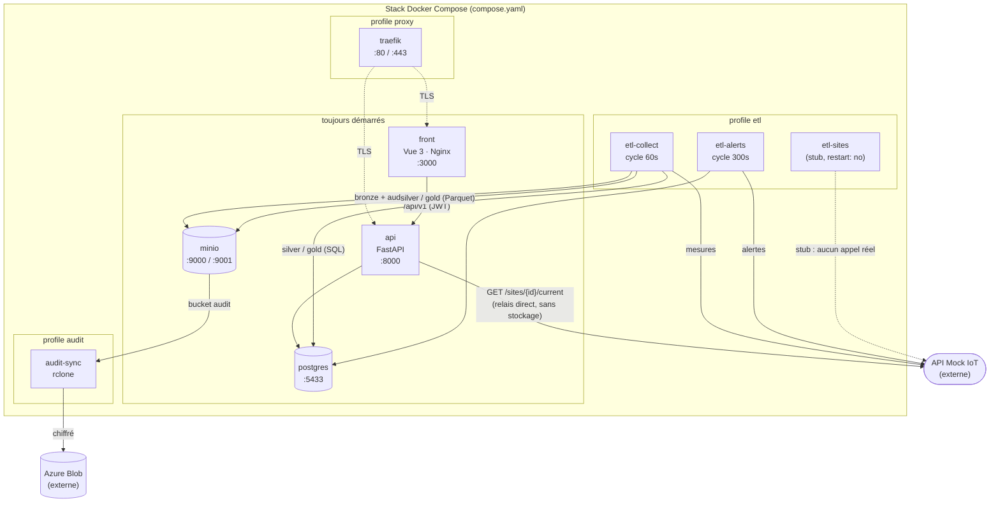
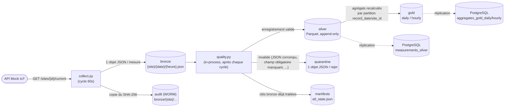
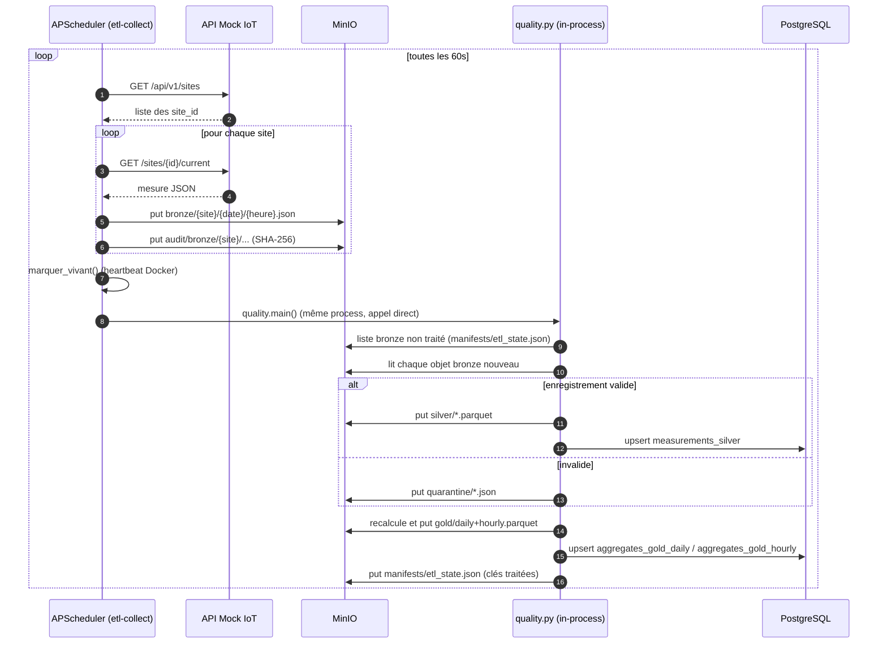
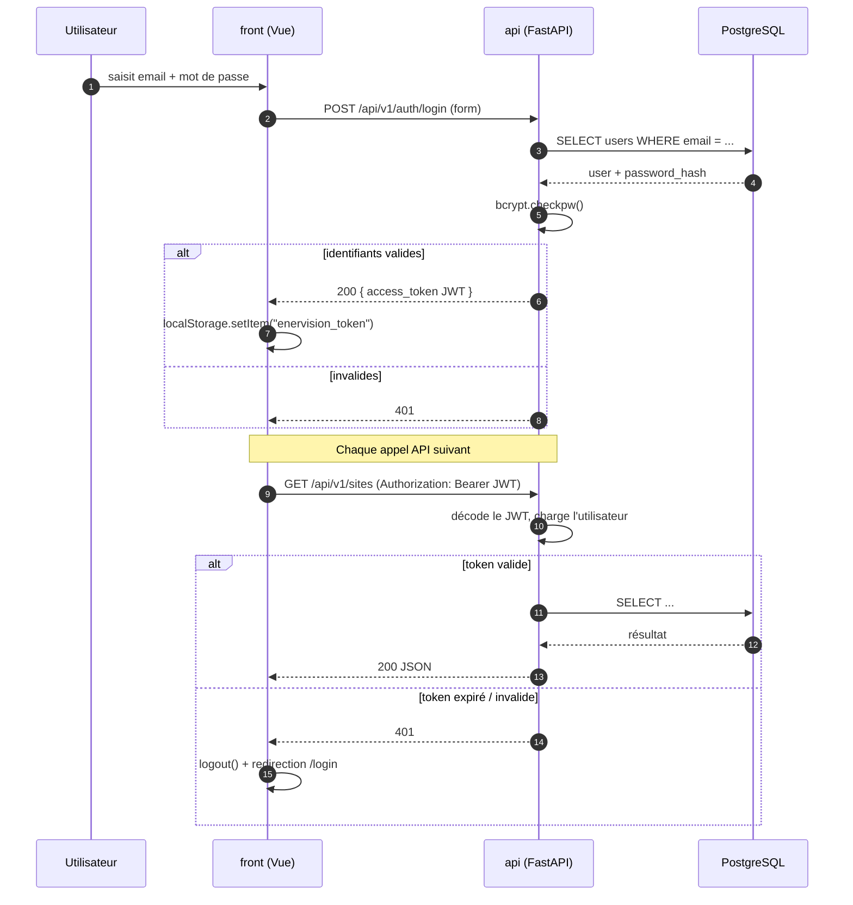

# EnerVision

Plateforme de suivi et d'optimisation énergétique : collecte de mesures IoT,
pipeline de qualité de données (bronze → silver → gold), API REST et interface web.

## Architecture

Application multi-services conteneurisée, orchestrée par un unique `compose.yaml`
à la racine.

| Service | Dossier | Rôle | Stack |
|---|---|---|---|
| **api** | [`api/`](api/) | API REST (auth, alertes, sites) | FastAPI, SQLAlchemy, PostgreSQL |
| **front** | [`front/`](front/) | Interface web | Vue 3, Vite, servi par Nginx en prod |
| **etl** | [`etl/`](etl/) | Collecte des mesures + qualité de données | Python, APScheduler, boto3 |
| **postgres** | — | Base de données | PostgreSQL 16 |
| **minio** | — | Stockage objet S3 (bronze/silver/gold/quarantine/audit) | MinIO |
| **audit-sync** | [`infra/audit-sync/`](infra/audit-sync/) | Réplication chiffrée MinIO → Azure Blob | rclone |
| **traefik** | [`infra/traefik/`](infra/traefik/) | Reverse proxy TLS | Traefik v2 |

### Diagrammes

#### Vue d'ensemble des services



`etl-collect` appelle `quality.py` en in-process juste après chaque cycle de collecte
(voir le diagramme de pipeline plus bas) : c'est pour ça qu'un seul conteneur écrit à la
fois sur `bronze`/`audit` et sur `silver`/`gold`.

#### Flux de données (bronze → silver → gold)



MinIO reste la source de vérité ; les mêmes lignes silver/gold sont répliquées dans
PostgreSQL pour être interrogeables en SQL par l'API. Une panne PostgreSQL n'interrompt
pas l'écriture MinIO.

#### Pipeline ETL — déroulé d'un cycle



Une erreur dans `quality.py` est interceptée et loguée sans jamais arrêter le
planificateur (voir `lancer_quality()` dans [`etl/collect.py`](etl/collect.py)) : au pire,
le prochain cycle rattrape les objets bronze non traités.

#### Authentification et requêtes API



Le rôle (`viewer` / `operator` / `admin`) est encodé dans le JWT et vérifié par
`require_role` / `require_min_role` (voir [`api/auth.py`](api/auth.py)) sur les routes qui
en ont besoin, par ex. `POST /api/v1/auth/users` réservé aux admins.

## Démarrage local

Prérequis : Docker Desktop en cours d'exécution.

```bash
cp .env.example .env          # valeurs de dev déjà utilisables telles quelles
docker compose up -d --build  # cœur : postgres, minio, api, front
```

| | URL |
|---|---|
| Front | http://localhost:3000 |
| API (OpenAPI) | http://localhost:8000/docs |
| Console MinIO | http://localhost:9001 |
| PostgreSQL | `localhost:5433` |

Services optionnels, derrière des profils Compose :

```bash
docker compose --profile etl up -d --build                        # + pipeline ETL
docker compose --profile etl --profile audit --profile proxy up -d --build   # tout
```

Créer le premier compte admin (aucune route publique de création) :

```bash
docker compose exec api python -m api.create_admin --email admin@enervision.fr
```

## Configuration

Toute la configuration passe par un seul fichier `.env` à la racine
(voir [`.env.example`](.env.example)). Le front a en plus un
[`front/.env.example`](front/.env.example) pour les variables `VITE_*`.

En Compose, le service `api` force `POSTGRES_HOST=postgres` / `POSTGRES_PORT=5432` ;
les valeurs `localhost:5433` du `.env` ne servent qu'à lancer l'API hors Docker.

## Tests

```bash
# API
pip install -r api/requirements-dev.txt
pytest api/tests

# ETL
pip install -r etl/requirements-dev.txt
cd etl && pytest

# Front
cd front && npm install && npm test
```

Les `requirements.txt` ne contiennent que le runtime (ce qui est installé dans les
images) ; pytest & co. sont dans les `requirements-dev.txt`.

## Qualité de code

`pre-commit` (ruff lint + format sur `api/` et `etl/`, normalisation des fins de
ligne) :

```bash
pip install pre-commit
pre-commit install
pre-commit run --all-files
```

## Déploiement

CI/CD GitHub Actions sur push `dev` : voir [`infra/DEPLOYMENT.md`](infra/DEPLOYMENT.md).

## Pistes connues (non traitées)

- **Migrations DB** : le schéma vit dans [`infra/postgres/init/`](infra/postgres/init/)
  (fait foi), les modèles SQLAlchemy restent partiels (`users`, `alerts`, `sites`).
  Introduire Alembic quand le modèle se stabilise.
- **`etl/sites.py` reste un stub** : le service `etl-sites` (`restart: "no"`) ne
  peuple pas encore la table `sites` automatiquement. Côté API, `GET /api/v1/sites`
  et `GET /api/v1/sites/{id}/current` existent désormais ([`api/routers/sites.py`](api/routers/sites.py)).
- **Tests front dans la CI** : `npm test` (Vitest) existe et passe en local, mais `.github/workflows/deploy-dev.yml` ne fait encore qu'un `npm run build` — l'ajouter au job `build-front`.
